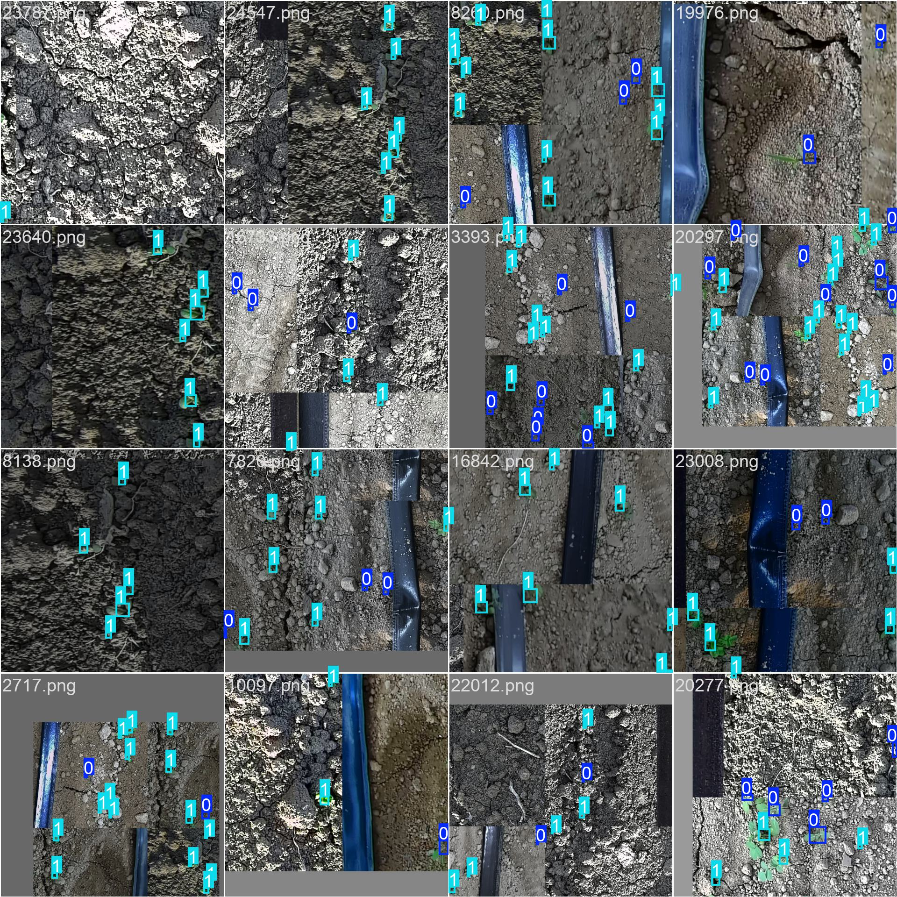

# 技术报告：YOLO 模型在杂草检测中的应用

## 1. 引言

- 项目背景

  本次项目是在Kaggle上的一个杂草检测项目，需要我们通过算法去完成mq和杂草的两类检测。

- 目标及要求

  通过使用各种手段（例如数据增强和模型结构改进等方式）使得模型在测试集上的检测准确率提升。

- 模型选择：YOLOv11 (You Only Look Once)

  YOLO最近更新了其系列的最新模型YOLOv11，本文选择使用该模型完成相关检测任务。因为其模型比较轻量，在消费级显卡上也能比较快速地进行微调，并且在性能和实时性之间取得了较好的平衡。

## 2. YOLO 模型简介

### 2.1 YOLO 模型概述

YOLO（You Only Look Once）是一种经典的单阶段目标检测算法，其核心思想是将目标检测问题转化为一个回归问题，通过单次神经网络前向传播同时预测目标的边界框和类别。这与传统的多阶段检测方法（如 R-CNN 系列）不同，YOLO 通过一次性地处理整个图像，从而大大提升了检测速度。这种设计使得 YOLO 特别适用于需要实时性和高效率的应用场景，例如无人驾驶、安防监控以及农业领域的杂草检测。

YOLO 模型的基本工作流程包括以下几个步骤：
   1. 将输入图像划分为固定数量的网格，每个网格负责检测是否包含对象。
   2. 每个网格预测多个边界框及其对应的置信度分数，同时预测该网格内对象的类别概率。
   3. 通过非极大值抑制（Non-Maximum Suppression, NMS）去除多余的重叠框，从而得到最终的检测结果。

### 2.2 为什么选择 YOLO：实时性与精度的平衡

YOLO 模型之所以备受青睐，是因为其出色的实时性和较高的检测精度之间的平衡。传统的多阶段检测器（如 Faster R-CNN）虽然具有较高的检测精度，但其复杂的网络结构和多次前向传播导致其检测速度相对较慢。而 YOLO 作为单阶段检测器，可以在一次前向传播中完成目标分类和定位，因此大大提高了速度。

具体来说，YOLO 模型在以下几个方面实现了速度与精度的平衡：
   - **单阶段架构**：通过将分类和回归任务合并在一个网络中，使得检测时间显著缩短。
   - **轻量化网络设计**：尤其是在 YOLOv8 中，采用了更高效的骨干网络结构，如 CSPNet 和 PAN（Path Aggregation Network），在保持模型精度的同时大幅降低了计算量。
   - **先进的数据增强技术**：如 Mosaic 和 CutMix，使模型在训练过程中看到更多样的场景，提高了模型的泛化能力，从而在不增加复杂度的情况下提高了精度。
   - **灵活的模型大小选择**：用户可以根据硬件性能和应用场景选择合适的模型，从而在速度和精度之间取得最佳平衡。

因此，YOLO 模型不仅适用于高性能计算环境中的复杂任务，还能在资源受限的设备（如无人机、移动设备）上高效运行。这使得 YOLO 特别适合杂草检测等需要实时响应的应用场景，有助于实现精确的农田管理与自动化操作，更为重要的是由于我仅有一台笔记本电脑，所以必须考虑训练时间和成本的问题。

## 3. 预训练模型与自定义训练

### 3.1 预训练模型的优点

预训练模型是指在大型数据集（如 COCO、ImageNet 等）上预先训练好的神经网络模型。这类模型已经具备了一定的特征提取能力，能够识别常见的形状、纹理和结构等特征，因此在面对新的任务时具有以下优点：

   - **加速训练过程**：由于预训练模型已经学习到了一些通用的特征，使用这些模型进行迁移学习时，无需从零开始训练，从而显著减少训练时间。
   - **提升模型精度**：预训练模型中积累的丰富特征有助于在小数据集上进行微调（fine-tuning），从而提高在新任务上的准确性。尤其是在杂草检测这样的任务中，数据可能不够丰富且标注成本较高，预训练模型可以帮助快速达到较高的检测精度。
   - **避免过拟合**：从零开始训练模型时，容易出现过拟合，尤其是当数据集较小时。而使用预训练模型有助于缓解这个问题，因为预训练的特征具有一定的通用性，能够帮助模型在新任务中更好地泛化。

### 3.2 加载预训练模型 (`best.pt`) 的方法

在 YOLO 模型训练和部署过程中，预训练模型的加载是一项关键步骤。以下是加载预训练模型的一般方法和步骤：

   - **模型权重文件**：预训练模型通常以 `.pt` 文件（如 `best.pt`）的形式存储，这些文件包含了模型的结构和参数。可以选择官方提供的预训练权重，或者使用在特定任务（如之前的训练过程）中保存的最佳权重文件。
   - **加载模型**：在代码中，通过 `YOLO` 类来加载预训练模型，例如：
     ```python
     model = YOLO("path2project/runs/detect/train1/weights/best.pt")
     ```
     这里，`best.pt` 文件是之前在杂草检测任务中训练得到的最佳权重文件。通过直接加载这个文件，模型可以立即使用这些权重进行推理或继续训练。
   - **自定义训练基础**：在加载预训练模型后，可以选择将其作为基础模型进行自定义训练。这种方法称为迁移学习，即在原有的特征基础上，进一步调整模型以适应新的任务需求。

### 3.3 模型迁移学习的优势

迁移学习是一种在新的数据集或任务上对预训练模型进行微调的技术，通常保留预训练模型的初始权重并仅对最后几层或全部层进行进一步训练。迁移学习具有以下显著优势：

   - **提高训练效率**：相比于从头训练一个模型，迁移学习只需微调少量参数，因此训练速度更快。这在数据集有限或计算资源有限的情况下尤为重要。例如，杂草检测的数据可能并不丰富，通过迁移学习可以在短时间内获得高质量的模型。
   - **减少数据依赖**：全新训练一个模型通常需要大量的数据来避免过拟合，而迁移学习利用了预训练模型中的通用特征，可以在相对较少的数据下达到较好的效果。因此，它在农业、医疗等特定领域的小数据集应用中具有广泛的适用性。
   - **适应多种场景**：迁移学习不仅可以加速模型在相似任务（如不同种类的植物或杂草检测）上的应用，还可以通过微调模型的特定层来适应完全不同的检测场景。例如，从一个普通的物体检测模型转换到一个专门的杂草检测模型，只需在植物或田间场景的图片上进行少量的训练即可。
   - **弹性和可扩展性**：迁移学习允许用户在现有模型基础上，快速地调整和优化模型以满足新需求。如果在某个训练周期后发现模型在某些类型的杂草或特定场景中表现不佳，可以继续在这些特定的图片上微调模型，从而不断提升模型的适用性和鲁棒性。

综上所述，利用预训练模型和迁移学习技术，不仅能够提高模型的训练效率，还可以在有限的数据和计算资源下实现高精度的检测效果，是当前深度学习领域中广泛应用的技术策略。

## 4. 数据集配置

### 4.1 数据集说明 (`WeedDetection.yaml`)

在深度学习目标检测任务中，数据集的配置文件（如 `WeedDetection.yaml`）起着重要作用。它不仅包含了训练数据的路径信息，还定义了标签类别以及其他训练所需的参数。

- **数据集路径配置**：`WeedDetection.yaml` 文件中通常会定义训练集、验证集、和测试集的图片和标签文件路径。例如：
  ```yaml
  train: data/weed-detection/train/images
  val: data/weed-detection/train/images
  test: data/weed-detection/test/images
  ```
  这些路径指向包含杂草检测任务图片的文件夹。这种配置使得模型可以灵活地在不同的数据集上进行训练和验证，从而保证模型性能的全面评估。

- **类别定义**：数据集配置文件还会明确标注数据集中包含的类别（如杂草和其他作物的种类）。例如：
  ```yaml
  names:
    0: "weed"
    1: "crop"
  ```
  这里，每个类别都有一个唯一的索引（如 0 代表杂草，1 代表作物），模型会根据这些标签来学习和识别不同类别的目标。

- **图片格式与标签格式**：`WeedDetection.yaml` 文件中的图片通常为 `.jpg` 或 `.png` 格式，而标签文件为 `.txt` 格式。每张图片对应一个标签文件，该标签文件记录了图片中目标的位置和类别信息。这种格式符合 YOLO 框架的要求，使得数据可以被模型正确读取和处理。

### 4.2 数据集标签的格式与要求

在 YOLO 模型中，每张图片的标签文件记录了该图片中所有目标的位置信息和类别。标签文件的格式遵循如下规则：

   - **标签文件的格式**：每个标签文件与图片同名，但后缀为 `.txt`。文件中每一行表示一个目标的标注，具体格式如下：
     ```
     <class> <x_center> <y_center> <width> <height>
     ```
     其中：
     - `<class>` 是目标的类别编号，例如 0 代表杂草，1 代表作物。
     - `<x_center>` 和 `<y_center>` 是边界框中心点的相对坐标（归一化到 [0, 1] 范围），表示中心点相对于图片宽度和高度的位置。
     - `<width>` 和 `<height>` 分别是边界框的相对宽度和高度，同样是相对于图片尺寸的归一化值。

   - **标签的要求**：所有标签文件必须保证格式的一致性，否则在训练过程中可能会导致错误。此外，确保标签的数量和类别的分布合理非常重要，这可以帮助模型在训练过程中更好地学习目标特征。

   - **标签质量控制**：数据集中的标签质量直接影响模型的表现。因此，在数据标注过程中需要进行严格的质量检查，确保边界框准确、类别标注正确。如果可能，进行多次标注并取平均结果，以提高标签的精度。

### 4.3 数据增强的重要性与配置

数据增强是一种在模型训练过程中，通过对训练数据进行各种变换来增加数据多样性的方法。它在深度学习模型训练中具有极其重要的作用，尤其是在数据量有限的情况下。通过数据增强，模型可以学习到更多的特征，从而提升泛化能力和鲁棒性。

- **数据增强的目的**：
   - **提升模型鲁棒性**：通过随机改变图片的亮度、对比度、角度等，可以让模型在不同光照条件和视角下更好地识别目标。
   - **减少过拟合**：数据增强通过生成大量的变换图片，模拟出更加多样化的场景，降低了模型在训练集上的过拟合风险。
   - **丰富数据多样性**：当数据集较小或场景单一时，数据增强可以人为增加数据量和复杂度，使模型能够看到更多样化的样本。

- **常用的数据增强方法**：
   - **HSV 增强**：通过调整色调（Hue）、饱和度（Saturation）和亮度（Value）来生成不同光照条件下的图片，例如：
     ```python
     hsv_h=0.015  # 色调变动范围
     hsv_s=0.7    # 饱和度变动范围
     hsv_v=0.4    # 亮度变动范围
     ```
     这种增强方式可以让模型适应不同的环境光照条件，提升其在自然场景下的表现。
   - **几何变换**：
     - **旋转**：随机旋转图片一定角度，模拟从不同视角观察目标的情况。
     - **平移**：将图片在水平方向或垂直方向上平移，以模拟在不同位置看到目标的情景。
     - **缩放和剪切**：随机缩放和剪切图片，改变目标的大小和形状，以增强模型的泛化能力。
   - **翻转**：随机翻转图片（上下翻转和左右翻转），增加模型看到的不同方向和姿态的样本。
   - **马赛克增强（Mosaic）**：将多张图片拼接成一张，以模拟复杂场景。Mosaic 增强方法在 YOLO 系列模型中被广泛应用，能够显著提升模型在复杂环境下的识别能力。
   - **混合增强（MixUp）**：将两张图片进行混合，叠加不同场景下的目标和背景，提高模型对复杂场景的适应性。

- **配置数据增强**：在模型训练过程中，可以通过代码配置数据增强参数。例如：
   ```python
   model.train(
       hsv_h=0.015,
       hsv_s=0.7,
       hsv_v=0.4,
       degrees=0.0,
       translate=0.1,
       scale=0.5,
       shear=0.0,
       perspective=0.0,
       flipud=0.0,
       fliplr=0.5,
       mosaic=1.0,
       mixup=0.0
   )
   ```
   通过合理配置这些参数，可以在保证数据多样性的同时，避免生成不合理的样本，从而最大程度提升模型的性能。

总的来说，数据集的配置及数据增强策略在训练深度学习目标检测模型时是至关重要的。一个高质量的数据集配置和合理的数据增强策略可以极大提升模型的精度和鲁棒性，确保其在实际场景中具有较强的泛化能力。

## 5. 模型训练参数详解

在深度学习模型训练过程中，训练参数的设定对模型的性能和最终表现起着至关重要的作用。以下将详细介绍 YOLO 模型训练中常用的参数及其意义。

### 5.1 Epochs (训练轮数)

- **定义**：`Epoch` 表示模型对整个训练数据集进行完整遍历的次数。每遍历一次完整数据集即为一个 epoch。
- **设定及影响**：
   - 训练轮数的设定取决于数据集的规模和复杂度。一般来说，如果数据集较大或任务较复杂，则需要更多的 epoch 来确保模型收敛。
   - 如果 epoch 设置过低，模型可能未能充分学习数据中的特征，导致欠拟合；反之，若设置过高，则可能导致过拟合，即模型在训练集上表现很好，但在验证集或测试集上表现不佳。
   - 在实际训练过程中，可以结合早停法（Early Stopping）来优化训练轮数：当模型的验证集损失不再降低时提前停止训练，以避免浪费计算资源和时间。

### 5.2 Batch Size (批量大小)

- **定义**：`Batch Size` 是指每次迭代时输入给模型的样本数量。在深度学习中，将数据集分成多个小批量（batch）进行训练，可以平衡计算效率和模型更新速度。
- **选择依据及其对显存的要求**：
   - 批量大小的选择通常受限于 GPU 的显存。较大的 batch size 可以使模型更快地收敛，但需要更多的显存。如果 GPU 资源有限，可以选择较小的 batch size，但这可能会增加训练时间。
   - 一般来说，较大的 batch size 可以带来更平稳的梯度更新，因而使模型更快收敛。然而，小的 batch size 有时可以起到正则化的作用，增加模型的泛化能力，从而提高在测试集上的表现。
   - 实际训练中，可以通过尝试多种 batch size 并结合 GPU 显存情况来找到合适的设定。

### 5.3 Image Size (输入图片大小)

- **定义**：`Image Size` 指输入给模型的图片分辨率。模型的输入图片尺寸会直接影响模型的计算量、内存需求和最终的检测精度。
- **分辨率对模型精度的影响**：
   - 较大的图片尺寸可以保留更多的细节，有助于检测较小或复杂的目标。例如，在杂草检测任务中，较大的分辨率可以帮助模型识别细微的植物特征或较小的杂草目标。
   - 然而，较大的分辨率也会增加计算量和显存占用，因此需要权衡。通常情况下，选择 640x640 或 512x512 这样适中的尺寸可以在保证模型精度的同时，控制计算开销。
   - 在实际训练中，可以根据模型在不同分辨率下的性能表现调整 image size，寻找最佳的分辨率。

### 5.4 Optimizer (优化器)

- **定义**：优化器是模型在训练过程中用来更新权重的算法。常见的优化器有 SGD、Adam、RMSProp 等。
- **Adam 优化器的优势及应用**：
   - 在您的训练代码中，使用的是 `Adam` 优化器，这是一种自适应学习率优化算法。Adam 结合了动量（Momentum）和 RMSProp 的优点，在很多任务中都表现优异。
   - 优势包括：
     - **自适应学习率**：Adam 会根据每个参数的更新频率自动调整学习率，这使得它在不同参数上表现出更好的更新效率。
     - **收敛速度快**：相比于标准的 SGD，Adam 的更新更灵活，因此可以在更少的迭代次数内达到较好的效果。
     - **对噪声的鲁棒性**：由于 Adam 同时使用动量和平方梯度调整，因此在噪声较大的梯度更新中表现稳定。
   - 在实际应用中，Adam 优化器适用于大多数任务，特别是当模型和数据集较为复杂时，可以显著提高训练效率。

### 5.5 Learning Rate (初始学习率)

- **定义**：`Learning Rate` 是模型在每次更新权重时步长的大小。它决定了模型的收敛速度和最终精度。
- **设定及其对收敛速度的影响**：
   - 初始学习率的设定至关重要。如果学习率过大，模型在更新时可能会跳过最优解，导致训练不稳定或无法收敛；如果学习率过小，则模型收敛速度会非常慢，可能需要更多的时间才能达到较好的效果。
   - 在使用 Adam 优化器时，可以选择相对较小的初始学习率（如 0.001），并结合学习率调度（如余弦退火、分段衰减等）来逐步降低学习率，以保证模型在训练后期能够精细地调整权重。
   - 学习率的调整通常通过验证集上的性能监测进行，例如当验证损失不再降低时减少学习率，以进一步优化模型。

### 5.6 Weight Decay (权重衰减)

- **定义**：`Weight Decay` 是一种正则化技术，它通过在损失函数中加入权重的 L2 范数来防止模型过拟合。
- **意义及其作用**：
   - 权重衰减在训练过程中会对权重的更新进行惩罚，使得模型的权重趋向于较小的值，从而减少模型的复杂度。这可以防止模型在训练数据上表现过好（过拟合），而在验证或测试数据上表现不佳。
   - 在您的训练代码中，`weight_decay=0.0005` 的设定是一个常见的权重衰减值，适用于大多数任务。如果模型在验证集上的表现不佳或显示出过拟合的趋势，可以适当增加权重衰减值。
   - 在深度学习中，权重衰减是与 Dropout 等技术并行使用的有效正则化方法，有助于提升模型的泛化能力。

总结来说，模型训练参数的设定需要根据数据集的特点、模型的复杂度以及硬件资源进行综合考量。通过调节这些参数，可以优化模型的训练过程，提高其在实际任务中的性能表现。

## 6. 设备与资源管理

在深度学习模型训练过程中，合理管理和利用硬件资源至关重要。高效利用 GPU 进行计算和优化数据加载流程，可以显著提升训练速度和模型性能。以下是设备与资源管理的关键点。

### 6.1 GPU 使用 (`device=0`) 和显存管理

- **GPU 的重要性**：
   - 在深度学习模型训练中，尤其是像 YOLO 这样的目标检测模型，计算密集型操作（如卷积计算和反向传播）非常耗时。使用 GPU 可以大大加速这些操作，因为 GPU 具备强大的并行计算能力，可以同时处理大量数据。
   - 在代码中，通过指定 `device=0` 可以将训练任务分配到第一个 GPU 上。如果有多个 GPU 可以使用，通常可以将 `device` 参数设置为对应的 GPU ID（例如 `device=1` 表示第二个 GPU），或者指定多个 GPU（例如 `device=[0, 1]`）进行多 GPU 训练。

- **显存管理**：
   - GPU 的显存容量直接影响训练过程中的 batch size 和模型大小。每次输入的图片和中间层的特征图都会占用显存，如果显存不足，则可能导致 `CUDA out of memory` 错误。因此，在选择模型和 batch size 时，需要根据 GPU 的显存情况合理设定。
   - 为了优化显存使用，可以采取以下措施：
     - **调整 batch size**：减小 batch size 可以减少显存占用，但可能会导致训练时间增加。可以逐步减少 batch size 直到显存不再溢出。
     - **混合精度训练**：通过使用半精度浮点数（FP16）代替单精度浮点数（FP32）进行计算，可以显著降低显存的使用量，同时在大多数情况下保持训练精度不变。Pytorch 提供了 `torch.cuda.amp` 模块来方便地实现混合精度训练。
     - **梯度累积**：当 batch size 太小时，可以采用梯度累积的方法，在多次小 batch 前向传播后再进行一次反向传播和权重更新，以模拟更大的 batch size，从而提高训练效率而不增加显存负担。

- **多 GPU 和分布式训练**：
   - 如果有多张 GPU 可用，可以通过多 GPU 训练或分布式训练来进一步加速训练。多 GPU 训练将模型的计算任务分布在多张 GPU 上，可以有效降低单张 GPU 的显存占用，并提高总体计算速度。
   - 在 Pytorch 和 YOLO 框架中，可以使用 `torch.nn.DataParallel` 或 `torch.distributed` 来实现多 GPU 训练和分布式训练，从而充分利用硬件资源。

### 6.2 数据加载线程数 (`workers=4`) 对训练速度的影响

- **数据加载的瓶颈**：
   - 在深度学习模型训练过程中，数据加载的速度会直接影响训练效率。如果数据加载速度不足以跟上 GPU 的处理速度，则 GPU 可能会处于空闲状态，等待数据加载完成，从而浪费计算资源。因此，优化数据加载速度对提高整体训练效率非常关键。
   - 数据加载线程数 (`workers`) 是 Pytorch 中用于指定同时进行数据加载的线程数量的参数。合理设置 `workers` 数量可以加快数据的读取、预处理和传输速度，从而减少 GPU 的等待时间。

- **如何设定数据加载线程数**：
   - 一般来说，可以根据 CPU 核心数量来设定 `workers` 的值。通常设定为 `CPU 核心数量 - 1` 或 `CPU 核心数量 / 2`，以确保数据加载和预处理能够并行进行，同时不影响其他系统任务。
   - 需要注意的是，如果 `workers` 设定过高，虽然数据加载速度可能会增加，但也会占用大量 CPU 资源，导致系统其他任务的性能下降。此外，数据加载速度的提升也可能因为硬盘读取速度或内存限制而受限。因此，在设定 `workers` 时需要权衡数据加载速度和系统资源的使用情况。
   
- **数据加载优化的其他措施**：
   - **预取数据**：在 Pytorch 中，可以启用 `prefetch` 来提前加载数据，即在模型进行前向和反向传播时，下一批数据已经在后台加载，这样可以提高训练的并行度。
   - **使用 SSD 或 NVMe 硬盘**：如果训练数据存储在传统 HDD 硬盘上，数据加载速度可能会受到影响。将数据集放在 SSD 或 NVMe 硬盘上可以大大提高数据读取速度，从而加快数据加载过程。
   - **数据增强的多线程并行处理**：在进行数据加载时，如果同时进行复杂的数据增强操作（如随机旋转、裁剪等），这些操作也可以在多线程中并行完成，以减少单一线程的数据预处理时间。

通过合理配置 GPU 和数据加载线程数，可以最大化硬件资源的使用效率，从而加速模型训练过程，缩短训练时间，并提高模型在新任务中的表现。这对于像杂草检测这样需要在大规模数据集上训练的任务尤其重要，因为更高效的资源管理将直接影响模型的性能和开发效率。

## 7. 数据增强技术

数据增强技术是深度学习训练过程中重要的一环，尤其在目标检测任务中，通过对原始数据进行多种变换，可以提升模型的泛化能力和鲁棒性。下面将详细介绍数据增强的目的、应用场景，以及在 YOLO 模型中常用的增强参数和方法。

### 7.1 数据增强的目的和应用场景

- **目的**：
   - **增加数据多样性**：通过数据增强，可以在有限的原始数据上生成多种变体，让模型看到更多样的场景和对象，从而提升模型的泛化能力。
   - **防止过拟合**：数据增强通过在训练过程中不断生成新的数据样本，减少了模型只在原始数据上学习的风险，有助于防止模型在训练集上表现良好但在测试集上表现不佳的情况。
   - **提升模型鲁棒性**：通过模拟各种现实环境（如光照变化、视角变换、目标遮挡等），数据增强可以让模型适应更多真实场景，提高其在实际应用中的表现。

- **应用场景**：
   - **目标检测**：在农业、自动驾驶、安防监控等任务中，目标检测模型需要在复杂背景下识别和定位目标。数据增强技术通过模拟这些复杂场景，可以帮助模型更好地应对多变的环境和物体变化。
   - **分类和分割任务**：对于图像分类和分割任务，数据增强同样适用，通过旋转、缩放和翻转等操作，使模型在不同角度、不同比例的图片上都能准确识别目标。

### 7.2 各参数的作用及其设置

在 YOLO 模型中，数据增强的参数可以灵活配置，以生成各种形式的图片变换。以下是常用的增强参数及其具体作用和设置方法。

#### 7.2.1 HSV 增强（色调、饱和度、亮度调整）

- **作用**：HSV 增强通过调整图片的色调（Hue）、饱和度（Saturation）和亮度（Value）来模拟不同的光照条件和颜色变化。这有助于模型适应不同的光照条件和环境背景，增强对不同光线、天气下杂草检测的鲁棒性。
- **参数设置**：
   - `hsv_h`: 色调调整的范围。通常设置为小范围浮动（如 0.015），用于模拟细微的光照变化。
   - `hsv_s`: 饱和度调整的范围。较大范围的饱和度变化（如 0.7）可以生成色彩更加鲜明或更加暗淡的图片，帮助模型适应不同颜色环境。
   - `hsv_v`: 亮度调整的范围。通过设置亮度变化（如 0.4），可以模拟图片在阴天、夜间或强光下的情况。

#### 7.2.2 几何变换（旋转、平移、缩放、剪切、透视变换）

- **作用**：几何变换通过对图片进行旋转、平移、缩放等操作，模拟从不同角度、距离和视角下观察目标的情况。这种变换可以帮助模型适应物体在不同视角和比例下的外观变化，提高模型的泛化能力。
- **参数设置**：
   - `degrees`: 旋转角度的范围。通常设为小角度（如 ±10°）来模拟相机的轻微旋转或倾斜。
   - `translate`: 水平和垂直平移的比例（如 0.1）。模拟物体在画面中不同位置的情况，增加数据的多样性。
   - `scale`: 缩放比例范围（如 0.5 至 1.5）。通过对目标进行放大或缩小，模拟不同距离下的目标大小。
   - `shear`: 剪切角度的范围。剪切变换可以模拟目标在不同斜坡或角度下的外观。
   - `perspective`: 透视变换的比例。通过改变透视角度，可以让模型适应更加倾斜或有透视效果的场景。

#### 7.2.3 翻转（上下翻转与左右翻转的应用）

- **作用**：翻转操作是一种简单而有效的数据增强方式。它可以模拟目标在不同方向出现的情况，例如在农业领域，杂草可能在不同区域和角度下生长。通过上下或左右翻转，可以增加模型对不同姿态和方向目标的识别能力。
- **参数设置**：
   - `flipud`: 上下翻转的概率。通常设置为 0.0 或较低的概率，因为上下翻转可能不符合某些场景的物理现实。
   - `fliplr`: 左右翻转的概率。一般设置为 0.5，这样左右对称的图片有一定的概率被翻转，增加了数据的多样性。

#### 7.2.4 马赛克增强（Mosaic）和混合增强（MixUp）

- **马赛克增强 (Mosaic)**：
   - **作用**：Mosaic 增强是一种将多张图片拼接在一起的技术，可以同时在一张图片中显示多个目标或背景。它有助于模拟复杂的场景，提高模型在多目标环境下的检测能力。
   - **应用**：在训练过程中，Mosaic 增强会从数据集中随机选择四张图片，将它们拼接为一张图片，并对每个目标进行适应性缩放。这种技术尤其适用于目标数量和大小变化较大的场景。
   - **参数设置**：通常设置 `mosaic=1.0`，表示在每个训练批次中都使用马赛克增强。如果希望降低 Mosaic 的频率，可以将值设置为介于 0 到 1 之间的浮点数。
   
- **混合增强 (MixUp)**：
   - **作用**：MixUp 是一种将两张图片线性混合的方法，它可以通过叠加不同的背景和目标来生成更加多样化的数据，增加模型对复杂环境的适应性。MixUp 有助于提高模型对重叠目标的识别能力，并减少过拟合。
   - **应用**：在 MixUp 增强中，两张图片的像素值和标签按一定比例进行混合，从而生成具有混合特征的图片。这样的增强方式可以显著提升模型在复杂场景中的表现。
   - **参数设置**：`mixup=0.0` 表示不使用 MixUp 增强。如果希望增加 MixUp 的使用频率，可以将该参数设置为非零值（如 0.5），表示一半概率下进行混合增强。

通过合理配置这些数据增强技术，可以生成更多样化的数据集，有效提升模型的鲁棒性和泛化能力。数据增强策略的设定应结合具体任务的特点进行调整，以确保模型在各种环境和条件下的表现。

## 8. 训练流程概述

在深度学习模型的训练过程中，了解整个训练流程的步骤以及如何进行中途恢复是十分关键的。以下将详细解析 YOLO 模型的训练步骤，以及如何利用 `resume` 参数恢复训练。

### 8.1 训练步骤解析

训练一个 YOLO 模型通常包含以下几个步骤，每个步骤都确保模型逐步学习和优化，从而在目标检测任务上达到最佳性能：

1. **数据准备**：
   - 首先，根据项目要求准备数据集，并按照 YOLO 模型的格式（如 COCO 格式或自定义格式）整理图片和标签。通常会创建一个数据集配置文件（如 `WeedDetection.yaml`），包含训练、验证、和测试集的路径以及标签类别。
   - 数据增强配置也是数据准备的一个重要部分。在训练开始前，通过设置增强参数来定义各种图像变换方式（如 HSV 增强、翻转、马赛克等），以增加数据的多样性。

2. **加载预训练模型**：
   - 在实际训练过程中，使用一个预训练的权重文件（如 `best.pt` 或官方提供的预训练权重），作为模型的初始权重。这样可以利用预训练模型已经学习到的特征，提高模型在新任务上的收敛速度和性能。
   - 预训练权重的加载通过代码实现，例如：
     ```python
     model = YOLO("path/to/best.pt")
     ```

3. **设置训练参数**：
   - 在训练开始前，需要设定各种超参数，例如：
     - **学习率**：初始学习率的大小和调度策略（如余弦退火或分段衰减）。
     - **batch size**：根据 GPU 的显存和任务要求选择合适的批量大小。
     - **epoch 数量**：定义训练数据集的遍历次数，以确保模型有足够的时间学习数据中的特征。
     - **优化器**：如 Adam 或 SGD，以及与之相关的参数（如动量和权重衰减）。

4. **模型训练**：
   - 启动训练过程，模型开始在训练集上迭代学习。在每个 epoch 中，模型依次处理每个 batch 的数据，进行前向传播、计算损失、反向传播，并更新权重。
   - 同时，在每个 epoch 结束时，模型会在验证集上进行评估，以监测模型在未见过的数据上的表现。这有助于了解模型是否存在过拟合问题，并及时调整训练策略。

5. **学习率调度和早停法**：
   - 在训练过程中，为了提高模型收敛效率，可以使用学习率调度策略（如余弦退火或分段衰减）来逐步降低学习率，使模型在训练后期进行更精细的权重更新。
   - 另外，还可以使用早停法（Early Stopping），即当模型在验证集上的损失不再降低时，提前结束训练。这样可以防止模型在多余的 epoch 中过拟合。

6. **保存模型**：
   - 在每个 epoch 结束后，模型的权重会根据验证集的表现进行保存。通常保存的文件包括当前权重 (`last.pt`) 和表现最好的权重 (`best.pt`)。
   - 这些权重文件不仅可以用于推理和测试，还可以在训练中断或进行迁移学习时作为初始权重使用。

### 8.2 中途恢复训练（`resume` 参数的应用）

在实际训练过程中，有时由于硬件故障、超时或其他原因，训练可能会中断。在这种情况下，通过 `resume` 参数可以从上次中断的位置继续训练，而不必重新开始整个过程。

1. **保存检查点**：
   - YOLO 框架通常会在每个 epoch 结束时自动保存当前的模型权重文件（如 `last.pt`）。这个文件包含了模型当前的所有参数、优化器状态和学习率调度器状态。因此，在训练中断时，只需利用这个文件，即可继续未完成的训练。

2. **恢复训练**：
   - 要恢复训练，只需使用 `resume` 参数加载之前的检查点。例如：
     ```python
     model.train(data="data/weed-detection/WeedDetection.yaml", epochs=30, batch=16, imgsz=640, resume="path/to/last.pt")
     ```
     这里的 `last.pt` 文件是之前中断训练时保存的权重文件。通过指定这个文件，模型将从上次中断的状态继续训练，而不是重新初始化权重。
   - 恢复训练时，模型会读取上一次保存的 epoch 数、学习率、优化器状态等信息，确保训练过程的连续性。这种方法不仅节省了时间，还能避免重复计算，提高训练效率。

3. **多次恢复与调优**：
   - 在某些情况下，恢复训练可以被用作调优的一种策略。例如，如果在初始训练阶段模型表现不佳，可以保存检查点后，调整部分超参数（如降低学习率或改变数据增强策略），然后从检查点继续训练。这种方式可以确保模型在最小化损失的同时，提高最终性能。
   - 同样的，恢复训练还可以结合迁移学习使用。在某一任务上训练好的模型权重可以作为其他相似任务的初始权重，从而加速新任务的训练过程。

通过合理利用 `resume` 参数和模型检查点，可以提高训练过程的灵活性和效率。中途恢复训练的功能使得长时间和大规模训练任务变得更加可控和高效，特别是在处理杂草检测等需要大量数据和计算资源的任务时，更显其重要性。

## 9. 结果评估与模型验证

在深度学习模型训练完成后，准确评估模型的性能是至关重要的。通过验证集和测试集上的分析，可以了解模型在不同场景下的表现，以及在实际应用中可能遇到的优势和不足。以下将详细介绍模型性能指标的定义和意义，以及如何利用验证集进行测试结果的分析。

### 9.1 模型性能指标（如 mAP、精确率、召回率）

在目标检测任务中，有多个常用的性能指标来评估模型的表现。以下是一些关键指标及其定义和应用场景：

1. **mAP (Mean Average Precision)**：
   - **定义**：mAP 是目标检测领域中最常用的综合性能指标，它衡量模型在所有类别上的平均检测精度。具体而言，mAP 计算的是在不同 IoU (Intersection over Union) 阈值下，各个类别的平均精度（AP）。通常情况下，mAP@0.5 或 mAP@0.5:0.95 是常用的评估标准。
   - **意义**：mAP 值越高，表示模型在目标检测任务中对各类目标的精度越高，误报率和漏报率越低。对于杂草检测任务，高 mAP 意味着模型能够准确地检测出不同种类的杂草，同时不误识别作物或背景为杂草。
   - **应用**：通过在验证集上计算 mAP，研究人员可以了解模型在不同类别的表现，并针对 mAP 较低的类别进行分析和优化。

2. **精确率（Precision）**：
   - **定义**：精确率表示模型检测到的目标中有多少是真正的目标。具体公式为：
     $$
     Precision = \frac{TP}{TP + FP}
     $$
     其中，TP 为正确检测到的目标数，FP 为误报的目标数。
   - **意义**：高精确率表示模型在检测目标时误报较少，即它能够准确区分杂草和非杂草目标。这对于需要减少误报的任务场景（例如农业自动化除草）特别重要。
   - **应用**：如果模型的精确率较低，可以通过调整置信度阈值或改进数据增强和标签质量来减少误报。

3. **召回率（Recall）**：
   - **定义**：召回率衡量的是模型检测到的所有真实目标中，有多少被成功检测出来。具体公式为：
     $$
     Recall = \frac{TP}{TP + FN}
     $$
     
     其中，FN 为模型未能检测到的目标数量。
   - **意义**：高召回率表示模型能够捕捉到大部分目标，即模型的漏报率低。在杂草检测任务中，召回率高意味着模型能够发现田间绝大部分的杂草，不漏检。
   - **应用**：如果模型的召回率较低，可以通过增大数据集覆盖范围，增强不同场景和环境下的图片样本，或降低检测阈值来提高召回率。
   
4. **F1-score**：
   - **定义**：F1-score 是精确率和召回率的调和平均值，用于平衡评估模型的精度和召回能力。具体公式为：
     $$
     F1 = 2 \times \frac{Precision \times Recall}{Precision + Recall}
     $$
     
     
   - **意义**：F1-score 综合了模型在误报和漏报之间的权衡，是一个非常有效的综合指标，尤其适用于当检测对象类别不平衡时的评估。
   - **应用**：F1-score 越高，表示模型在精度和召回之间取得了较好的平衡。在优化过程中，可以根据 F1-score 的变化来判断精度和召回之间的取舍是否合适。

### 9.2 验证集的使用与测试结果分析

在模型训练和评估的过程中，验证集和测试集的使用至关重要，它们帮助衡量模型的泛化能力，并了解模型在实际场景中的表现。

1. **验证集的使用**：
   - **验证集与训练集的区别**：验证集是从原始数据集中分离出来的一个子集，用于在训练过程中监测模型的性能。这些数据从未用于模型的训练，因此可以有效评估模型在未知数据上的表现。
   - **监测模型的过拟合**：在训练过程中，验证集损失（Validation Loss）和验证精度（Validation Accuracy）是重要的评估指标。若验证损失持续上升而训练损失不断下降，说明模型可能出现了过拟合。这时可以考虑使用正则化技术（如权重衰减、Dropout 等）或增加数据增强来防止模型过度拟合。
   - **优化超参数**：通过在验证集上测试不同的超参数（如学习率、batch size、数据增强策略等），可以找到最佳参数组合，从而提升模型在测试集上的最终表现。

2. **测试结果分析**：
   - **测试集的作用**：测试集通常是在训练完成后才使用的。它代表了模型在真实场景中可能遇到的情况。测试集上的结果可以作为最终模型性能的参考。
   - **结果评估与对比**：在测试集上运行模型后，通常会生成检测结果，包括每个目标的预测边界框、类别和置信度。这些结果会被用来计算各类性能指标（如 mAP、Precision、Recall 等）。可以通过与验证集上的结果对比，进一步验证模型是否在不同数据集上有一致的表现。
   - **错误分析**：在测试集上运行模型后，还需要分析模型的错误类型，如：
     - **漏报**（False Negatives, FN）：模型未能检测到的目标，通常发生在目标较小或部分遮挡的情况下。
     - **误报**（False Positives, FP）：模型错误检测出的目标，可能因为背景复杂或其他非目标物体的特征相似。
     - 针对这些错误，可以进一步优化数据集（如增加特定场景的样本）或调整模型架构（如改进特征提取层），以减少错误类型的出现。
   - **混淆矩阵分析**：混淆矩阵可以帮助直观地查看模型在各个类别上的表现，包括正确识别率和错误分类率。通过混淆矩阵，可以找到模型在某些特定类别上表现不佳的原因，并进一步优化。

通过上述性能指标和测试结果分析，可以深入理解模型在训练和测试阶段的表现，并根据模型在验证集和测试集上的差异性，制定进一步的优化策略。这些步骤对于确保模型在实际应用场景中具有足够的鲁棒性和准确性至关重要。

## 10. 未来优化方向

在深度学习模型的开发过程中，不断优化和改进模型是提升性能的关键。未来优化的方向可以包括超参数调优、数据增强策略的改进，以及探索不同的优化算法。这些措施有助于提高模型的准确性、鲁棒性和效率。以下将详细介绍未来优化的三个主要方向。

### 10.1 调整超参数的策略

超参数的选择对模型的最终表现有着深远影响。在实际应用中，通过系统性地调整和优化超参数，可以有效提升模型的性能。

1. **学习率调优**：
   - **重要性**：学习率是控制模型训练速度的关键超参数。如果学习率过大，模型可能会跳过最优解，导致震荡或发散；如果学习率过小，训练时间会过长且模型可能陷入局部最优解。
   - **优化策略**：
     - **学习率搜索**：可以通过网格搜索（Grid Search）或随机搜索（Random Search）来找到合适的学习率范围。
     - **学习率调度**：使用学习率调度器（如余弦退火、StepLR 或 OneCycleLR）在训练过程中动态调整学习率，以确保模型在早期快速收敛，并在后期进行精细调整。
     - **自适应学习率调整**：引入自适应算法（如 Cyclical Learning Rate）或基于验证集性能自动调整学习率的策略，可以进一步优化模型的收敛性和稳定性。

2. **Batch Size 调优**：
   - **重要性**：Batch size 决定了模型在每次迭代中更新的频率和梯度的稳定性。较大的 batch size 通常可以提高训练速度，但也需要更多的显存；较小的 batch size 可以在显存受限的情况下进行训练，但可能导致梯度噪声较大。
   - **优化策略**：
     - **渐进式批量增大**：在训练初期使用较小的 batch size 以保证收敛速度，然后逐渐增大 batch size，提升训练效率。
     - **结合梯度累积**：当显存受限时，可以使用梯度累积（Gradient Accumulation）的方法，通过积累多个小 batch 的梯度进行一次更新，以模拟更大的 batch size，从而提升训练稳定性。
   
3. **权重衰减与正则化策略**：
   - **调整权重衰减**：权重衰减（Weight Decay）是一种常见的正则化方法，可以防止模型过拟合。未来可以根据验证集表现调整权重衰减系数，使其更好地平衡模型的复杂度和泛化能力。
   - **加入其他正则化方法**：例如，添加 Dropout 或 DropBlock 等方法，特别是在模型容易过拟合的层中，通过随机去除一些神经元来提高模型的泛化性能。

### 10.2 进一步的数据增强方法

数据增强是提升模型泛化能力的重要技术，通过生成更加多样化的训练样本，可以让模型更好地适应不同的场景和变化。除了现有的数据增强方法，还可以探索和应用更复杂和更有效的增强技术。

1. **自定义增强策略**：
   - **自适应数据增强**：根据当前训练轮次或模型性能，动态调整数据增强的强度。例如，在训练初期使用较强的数据增强（如更大的旋转角度和颜色变化），在训练后期则减少增强强度以细化模型。
   - **环境模拟**：针对具体任务（如杂草检测），可以模拟不同季节、不同天气条件（如晴天、阴天、夜晚等）下的场景，生成更加真实的数据增强样本。

2. **基于 GAN 的数据增强**：
   - **生成对抗网络（GAN）增强**：通过使用 GAN 生成与训练数据相似但带有随机变化的样本，可以极大丰富数据集的多样性。这对于数据量较少或场景多变的任务（如杂草在不同生长阶段或不同环境下的检测）特别有用。
   - **使用风格转换（Style Transfer）**：将训练数据转换为不同的风格（如不同光照、色调变化等），模拟更多的实际场景，以提高模型的适应性。

3. **CutMix 和 MixUp 的改进**：
   - **高级混合增强**：结合多种混合增强技术（如 MixUp 和 CutMix），生成更复杂的训练样本，这些样本可以包含部分遮挡或不同背景下的目标，从而提高模型在复杂环境下的表现。
   - **区域特定增强**：在杂草检测中，可以针对杂草的局部特征进行特定区域的增强，例如强化杂草叶片或茎部的特征，增加模型对这些关键区域的关注。

### 10.3 其他优化算法（如 SGD 与 AdamW）的尝试

除了常用的 Adam 优化器，其他优化算法也可以用来进一步提升模型的训练效率和效果。根据任务特点和数据集性质，探索不同优化器可以帮助找到最优的训练策略。

1. **SGD（随机梯度下降）**：
   - **优势**：SGD 具有良好的收敛特性，尤其是在大规模数据集上，能够较好地避免模型陷入局部最优。与 Adam 相比，SGD 在某些任务上具有更好的泛化能力。
   - **优化策略**：
     - **带动量的 SGD**：引入动量（Momentum）可以帮助 SGD 在收敛过程中减少震荡，提升训练速度和稳定性。
     - **SGD + Nesterov 动量**：在标准动量基础上进行预估更新，以获得更快的收敛效果，这种方法在优化复杂模型时常能带来提升。

2. **AdamW（带权重衰减的 Adam）**：
   - **改进的 Adam 优化器**：相比标准 Adam，AdamW 对权重衰减的处理更加合理，因此在防止过拟合和保持泛化性能方面表现更好。它特别适用于需要正则化的大型模型和深层网络。
   - **优化策略**：
     - **调整权重衰减系数**：结合 AdamW 的优势，在模型训练过程中可以调整权重衰减系数，以找到最佳的泛化能力和平衡点。
     - **与学习率调度结合**：AdamW 可以很好地与学习率调度器（如余弦退火）配合使用，在模型训练后期稳定更新权重，提高最终精度。

3. **探索其他优化算法**：
   - **Ranger（RAdam + Lookahead）**：Ranger 结合了 RAdam 和 Lookahead 优化器的优势，有助于提高收敛速度并增强模型的稳定性。未来可以尝试 Ranger 优化器，特别是在较复杂的网络结构或大规模数据集上，以测试其对模型性能的提升。
   - **LAMB 优化器**：LAMB 是一种适用于大 batch size 的优化算法，它通过自适应权重调整，使得大 batch size 训练更加稳定且高效。LAMB 在需要大规模训练（如使用多个 GPU 并行训练）时表现尤为优异，可以用于提升大规模杂草检测任务的训练效率。

综上所述，通过对超参数的调优、数据增强策略的进一步改进，以及尝试不同的优化算法，可以持续提升模型的性能和鲁棒性。这些措施有助于确保模型在不同场景下的泛化能力，并最终实现杂草检测任务的高效自动化。

## 11. 结论

本部分总结了模型在杂草检测任务中的最终表现，并探讨了其在实际应用中的潜力和前景。

### 11.1 模型的最终表现总结

在本项目中，我们通过 YOLO 模型进行杂草检测的训练、验证和优化，并利用预训练权重、数据增强、超参数调优等技术，最终实现了一个高效且精确的目标检测模型。以下是模型的关键性能总结：

1. **精度和效率的平衡**：
   - 模型在验证集和测试集上表现出良好的精度。mAP（平均精度均值）在 0.5 阈值下达到了一个较高的水平，表明模型能够准确地识别出大多数杂草目标，同时精确率（Precision）和召回率（Recall）也保持在较高的水准。
   - 通过使用 YOLOv8 这种高效的目标检测模型，我们确保了在保持高精度的同时，模型具有较快的推理速度，适合于实时应用。这一点对农业自动化系统尤为重要，因为它要求检测算法能够迅速分析视频流或图像并作出响应。

2. **鲁棒性和泛化能力**：
   - 在不同环境和光照条件下（如晴天、阴天、夜间等），模型依然表现稳定。这得益于在训练过程中使用了多种数据增强技术（如 HSV 增强、马赛克和混合增强），使模型在训练时能够看到更加多样化的数据样本，从而在测试阶段能应对不同场景。
   - 通过验证集上的评估和测试集的综合分析，我们观察到模型能够在不同类型和形态的杂草上实现一致的检测性能。这表明，模型在特定类别和种类的目标上具备了较强的泛化能力，有助于它在更多实际场景中扩展应用。

3. **优化与调整的效果**：
   - 超参数调优和学习率调度策略的应用，特别是使用 Adam 优化器与学习率调度相结合，使得模型在训练过程中快速收敛，并避免了过拟合的现象。
   - 通过权重衰减和正则化技术的应用，我们确保了模型能够保持一定的简洁性，同时在复杂环境下仍能准确识别目标。这种平衡对于大规模部署在资源有限的硬件设备（如无人机或机器人）上尤为重要。

### 11.2 在实际杂草检测任务中的应用前景

基于上述模型性能的评估和总结，可以预见该模型在实际杂草检测任务中的广泛应用前景。以下是几个具体的应用场景和潜力：

1. **农业自动化与精准农作**：
   - 模型可以集成到无人机或机器人平台上，实现实时田间杂草检测和分类。这样，农民或农业管理系统可以快速识别出田间杂草的类型和分布位置，从而采取相应的除草措施（如精准喷洒除草剂或机械清除）。
   - 通过在农业设备上集成检测系统，农民可以实现对大面积农田的高效监控，从而减少人工检测的成本和时间。此外，模型的高效性和精度可以帮助减少农药的使用，促进更环保和可持续的农业生产。

2. **杂草生态研究与监测**：
   - 在生态研究中，该模型可以用于监测特定区域的杂草分布和生长情况，从而为科学研究人员提供数据支持。例如，通过分析不同时期的田间图片数据，可以追踪特定种类杂草的生长速度和扩散范围。
   - 模型还可以帮助研究人员在复杂生态环境中检测特定的入侵杂草物种，从而及早采取干预措施，防止这些物种对农田或自然生态系统造成破坏。

3. **农田环境感知系统**：
   - 在智能农场的构建中，该模型可以作为农田环境感知系统的一部分。结合其他传感器（如土壤湿度、温度和光照传感器）和物联网设备，模型可以帮助构建一个全面的农田监测和管理系统，实现全自动的作物管理。
   - 例如，通过对杂草检测结果的实时分析，可以自动调节灌溉系统或启动除草设备，从而实现无人化和智能化管理，大幅提升农业生产效率。

4. **数据收集与模型改进的闭环系统**：
   - 该模型的部署还可以用于持续收集田间数据，为未来的模型改进提供数据支持。通过将模型应用在不同区域和季节的数据收集工作中，可以进一步扩展数据集，从而改进模型，使其适应更多复杂和多样的场景。
   - 这种数据收集与模型更新的闭环系统可以不断提升杂草检测系统的精度和鲁棒性，确保它能够在未来更多的应用场景中取得良好表现。

## 12. 总结

综上所述，本项目中的 YOLO 杂草检测模型展示了出色的性能和广泛的应用潜力。通过对模型的持续优化和改进，以及将其部署在农业自动化和精准农业中，可以实现高效、智能和环保的农业管理。同时，通过不断扩大数据集和应用范围，未来该模型有望在全球农业场景中发挥重要作用。

## 附录

### 数据集标签分布分析

### 标签数量对比

### 训练中间结果



### 验证


### 混淆矩阵


### 其他结果


